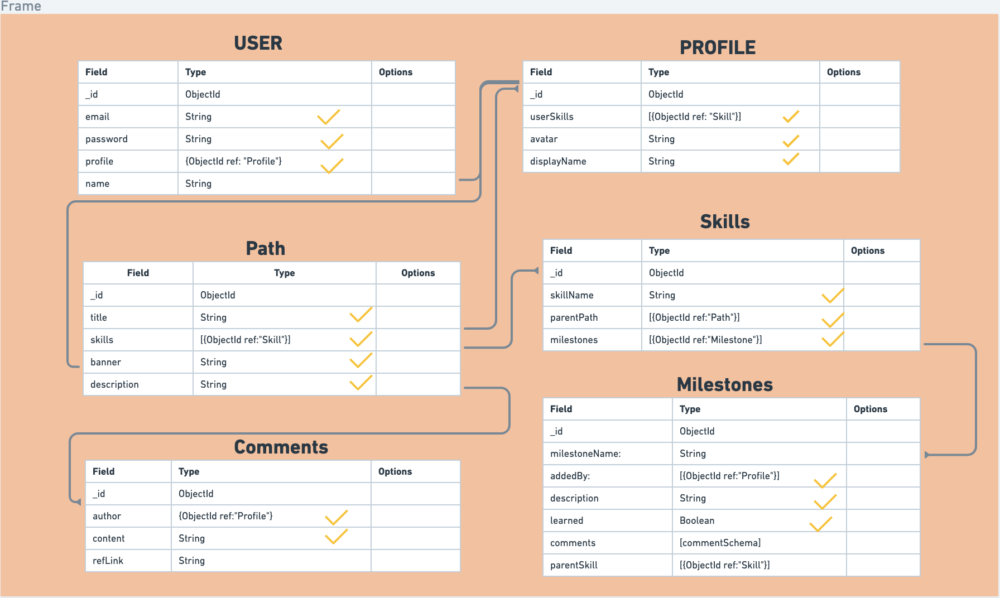
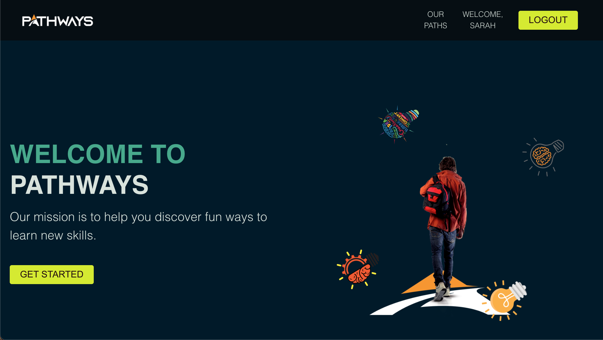
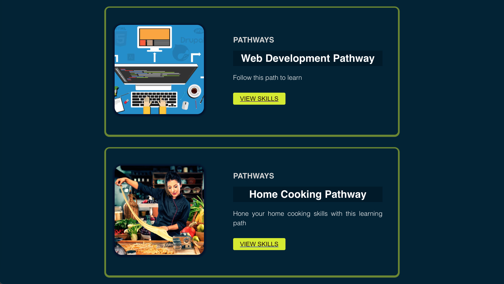

# Pathways

...Is an app to track your progress in learning a new skill. It also has social features to help spread encouragement in a users learning journey. Users can create "Pathways", which can be seen as a set of skill trees towards learning a subject. Each Pathway has multiple "checkpoints", aka skill trees, and inside each checkpoint there is a checklist of milestones. To give an example, the "Web Development Pathway" will be structured kind of like David's lecture materials in notion. The checkpoints will be "javascript" or "css", etc, and inside each one will have the milestones of skills within that subject. The social features come in as comments on the milestones. Users can leave comments/words of encouragement, as well as links to resources they might find helpful to others.  🛣️

## Getting Started

>App Link:
- [Pathways](https://learn-with-pathways.herokuapp.com/)

>Trello Board:
- [Trello](https://trello.com/b/7WLSQJsP/pathways-by-team-trifecta)

>Wireframes:
- [Wireframes](https://whimsical.com/pathways-NJhkun5pK8vKygZ3JdYaCY)

#### ERD:

#### App Images:

#### Credit: Home Cook Pathway Photo 
- [goodfon](https://img2.goodfon.com/wallpaper/nbig/1/17/povar-produkty-pasta-gotovka.jpg)
- [lottiefiles](https://lottiefiles.com/61425-light-learning)
  
#### Team Members:
- Junior
  * Designer
  * API Manager
- Rose
  * GitHub Manager
  * Scrum Master
- SJ
  * Database Manager
  * Documentor

#### Technologies and sites used:
- Javascript
- CSS
- MongoDB
- Express
- Mongoose
- Node.js
- Token-based auth
- React
- Font Awesome
- React Rainbow Components
- Unsplash
- Goodfon.com
- lottiefiles.com

#### Next Steps:
- Option to delete milestone
- Like feature on comments
- Want users to be able to add their own pathway

